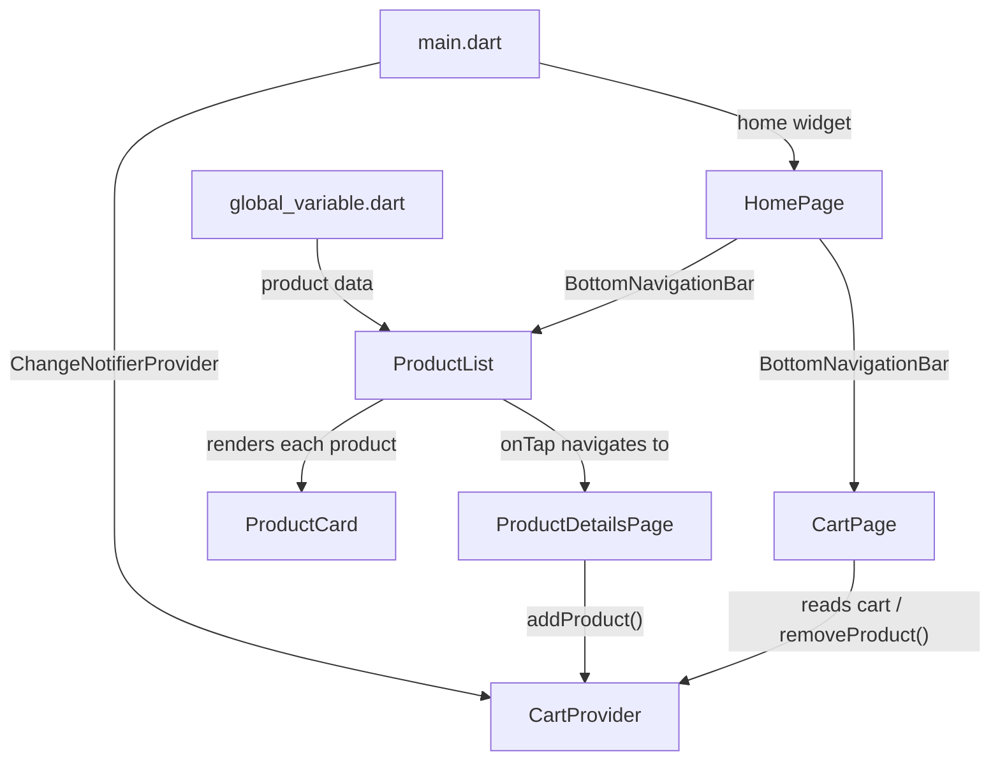

# 👟 Shopping App

A Flutter-based shoe shopping application that lets users browse a curated catalog of shoes, filter by brand, view product details with size selection, and manage a shopping cart — all with a clean, Material 3 UI.

## ✨ Features

- **Product Catalog** — Browse a scrollable list of shoes with title, price, and product image
- **Brand Filtering** — Filter products by brand (All · Nike · Adidas · Bata) using interactive chips
- **Search Bar** — Search UI integrated into the home screen
- **Product Details** — Tap any product to view a detailed page with full-size image, price, and available sizes
- **Size Selection** — Choose a shoe size from interactive chips before adding to cart
- **Shopping Cart** — View all added items with thumbnail, title, and selected size
- **Remove from Cart** — Delete items with a confirmation dialog to prevent accidental removals
- **Bottom Navigation** — Seamless switching between Home and Cart tabs using `IndexedStack`
- **Snackbar Feedback** — Instant feedback on add-to-cart and size-validation actions
- **Custom Theming** — Yellow-gold color scheme with the Lato font family

## 📸 Screenshots

<!-- Add your screenshots here -->
<!-- | Home | Details | Cart | -->
<!-- |------|---------|------| -->
<!-- |  |  |  | -->

## 🛠 Tech Stack

| Technology | Purpose |
|---|---|
| [Flutter](https://flutter.dev/) | Cross-platform UI framework |
| [Dart](https://dart.dev/) | Programming language |
| [Provider](https://pub.dev/packages/provider) | State management |
| Material 3 | Design system |

## 📁 Project Structure

```
lib/
├── main.dart                         # App entry point, theme config, Provider setup
├── global_variable.dart              # Hardcoded product data (catalog)
│
├── Pages/
│   ├── home_page.dart                # Shell with BottomNavigationBar (Home / Cart)
│   ├── product_details_page.dart     # Product detail view with size picker & add-to-cart
│   └── cart_page.dart                # Cart list with delete functionality
│
├── Providers/
│   └── cart_provider.dart            # ChangeNotifier for cart state (add / remove)
│
└── Widget/
    ├── product_list.dart             # Product listing with search bar & brand filters
    └── product_card.dart             # Reusable product card widget

assets/
├── images/                           # Shoe product images (shoes_1–4.png)
└── fonts/                            # Lato-Light.ttf, Lato-Bold.ttf
```

## 🏗 Architecture



**Data Flow:**
1. `main.dart` wraps the app in a `ChangeNotifierProvider<CartProvider>`
2. `HomePage` uses an `IndexedStack` to switch between `ProductList` and `CartPage`
3. `ProductList` reads the product catalog from `global_variable.dart` and renders `ProductCard` widgets
4. Tapping a card navigates to `ProductDetailsPage`, where users select a size and add to cart
5. `CartPage` listens to `CartProvider` and displays all cart items with a delete option

## 🚀 Getting Started

### Prerequisites

- [Flutter SDK](https://docs.flutter.dev/get-started/install) (≥ 3.12.2)
- Dart SDK (bundled with Flutter)
- An emulator/simulator or a physical device

### Installation

```bash
# Clone the repository
git clone https://github.com/Ranveer1332/Shopping_App.git
cd Shopping_App

# Install dependencies
flutter pub get

# Run the app
flutter run
```

## 📦 Dependencies

| Package | Version | Purpose |
|---|---|---|
| [`provider`](https://pub.dev/packages/provider) | ^6.1.5+1 | Reactive state management for the cart |
| [`google_fonts`](https://pub.dev/packages/google_fonts) | ^8.2.1 | Google Fonts integration |
| [`cupertino_icons`](https://pub.dev/packages/cupertino_icons) | ^1.0.8 | iOS-style icons |
| [`flutter_lints`](https://pub.dev/packages/flutter_lints) | ^6.0.0 | Recommended lint rules (dev) |

## 🎨 Customization

### Adding a New Product

Edit [`global_variable.dart`](lib/global_variable.dart) and add an entry to the `products` list:

```
{
  'id': '4',
  'title': 'Puma Running Shoes',
  'price': 55.99,
  'imageUrl': 'assets/images/shoes_5.png',
  'company': 'Puma',
  'sizes': [8, 9, 10, 11],
},
```

Then:
1. Add the image to `assets/images/`
2. Register it in `pubspec.yaml` under `flutter > assets`
3. Add `'Puma'` to the `filters` list in [`product_list.dart`](lib/Widget/product_list.dart)

## 📄 License

This project is for educational / personal use.
